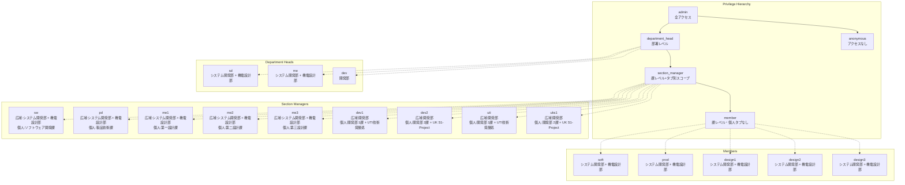

# Privilege Configuration Visualization

## Privilege Hierarchy

## Data Scope by Privilege and Tab

| Privilege | 時系列 | グループ比較 | 評価 | 個人 | 分布 |
|---|---|---|---|---|---|
| admin | 全て | 全て | 全て | 全て | 全て |
| anonymous | なし | なし | なし | なし | なし |
| design1 | システム開発部 + 機電設計部 | システム開発部 + 機電設計部 | システム開発部 + 機電設計部 | なし | なし |
| design2 | システム開発部 + 機電設計部 | システム開発部 + 機電設計部 | システム開発部 + 機電設計部 | なし | なし |
| design3 | システム開発部 + 機電設計部 | システム開発部 + 機電設計部 | システム開発部 + 機電設計部 | なし | なし |
| dev | 開発部 | 開発部 | 開発部 | 開発部 | 開発部 |
| dev1 | 開発部 | 開発部 | 開発部 | 開発部 1課 + UTI技術発展処 | 開発部 1課 + UTI技術発展処 |
| dev2 | 開発部 | 開発部 | 開発部 | 開発部 2課 + UK S1-Project | 開発部 2課 + UK S1-Project |
| develop | 開発部 | 開発部 | 開発部 | なし | なし |
| me | システム開発部 + 機電設計部 | システム開発部 + 機電設計部 | システム開発部 + 機電設計部 | システム開発部 + 機電設計部 | システム開発部 + 機電設計部 |
| me1 | システム開発部 + 機電設計部 | システム開発部 + 機電設計部 | システム開発部 + 機電設計部 | 第一設計課 | システム開発部 + 機電設計部 |
| me2 | システム開発部 + 機電設計部 | システム開発部 + 機電設計部 | システム開発部 + 機電設計部 | 第二設計課 | システム開発部 + 機電設計部 |
| me3 | システム開発部 + 機電設計部 | システム開発部 + 機電設計部 | システム開発部 + 機電設計部 | 第三設計課 | システム開発部 + 機電設計部 |
| pd | システム開発部 + 機電設計部 | システム開発部 + 機電設計部 | システム開発部 + 機電設計部 | 製品技術課 | システム開発部 + 機電設計部 |
| prod | システム開発部 + 機電設計部 | システム開発部 + 機電設計部 | システム開発部 + 機電設計部 | なし | なし |
| sd | システム開発部 + 機電設計部 | システム開発部 + 機電設計部 | システム開発部 + 機電設計部 | システム開発部 + 機電設計部 | システム開発部 + 機電設計部 |
| soft | システム開発部 + 機電設計部 | システム開発部 + 機電設計部 | システム開発部 + 機電設計部 | なし | なし |
| sw | システム開発部 + 機電設計部 | システム開発部 + 機電設計部 | システム開発部 + 機電設計部 | ソフトウェア開発課 | システム開発部 + 機電設計部 |
| uks1 | 開発部 | 開発部 | 開発部 | 開発部 2課 + UK S1-Project | 開発部 2課 + UK S1-Project |
| uti | 開発部 | 開発部 | 開発部 | 開発部 1課 + UTI技術発展処 | 開発部 1課 + UTI技術発展処 |

## Data Scope by Grouping local filter
| Privilege | なし | 部署別・課別・チーム別・プロジェクト別 | 職位別 | 個人別 |
|---|---|---|---|---|
| admin | 全て | 全て | 全て | 全て |
| anonymous | なし | なし | なし | なし |
| design1 | システム開発部 + 機電設計部 | システム開発部 + 機電設計部 | システム開発部 + 機電設計部の非管理職 | なし |
| design2 | システム開発部 + 機電設計部 | システム開発部 + 機電設計部 | システム開発部 + 機電設計部の非管理職 | なし |
| design3 | システム開発部 + 機電設計部 | システム開発部 + 機電設計部 | システム開発部 + 機電設計部の非管理職 | なし |
| dev | 開発部 | 開発部 | 開発部 | 開発部 |
| dev1 | 開発部 | 開発部 | 開発部 | 開発部 1課 + UTI技術発展処 |
| dev2 | 開発部 | 開発部 | 開発部 | 開発部 2課 + UK S1-Project |
| develop | 開発部 | 開発部 | 開発部 | なし |
| me | システム開発部 + 機電設計部 | システム開発部 + 機電設計部 | システム開発部 + 機電設計部 | システム開発部 + 機電設計部 |
| me1 | システム開発部 + 機電設計部 | システム開発部 + 機電設計部 | システム開発部 + 機電設計部 | 第一設計課 |
| me2 | システム開発部 + 機電設計部 | システム開発部 + 機電設計部 | システム開発部 + 機電設計部 | 第二設計課 |
| me3 | システム開発部 + 機電設計部 | システム開発部 + 機電設計部 | システム開発部 + 機電設計部 | 第三設計課 |
| pd | システム開発部 + 機電設計部 | システム開発部 + 機電設計部 | システム開発部 + 機電設計部 | 製品技術課 |
| prod | システム開発部 + 機電設計部 | システム開発部 + 機電設計部 | システム開発部 + 機電設計部の非管理職 | なし |
| sd | システム開発部 + 機電設計部 | システム開発部 + 機電設計部 | システム開発部 + 機電設計部 | システム開発部 + 機電設計部 |
| soft | システム開発部 + 機電設計部 | システム開発部 + 機電設計部 | システム開発部 + 機電設計部の非管理職 | なし |
| sw | システム開発部 + 機電設計部 | システム開発部 + 機電設計部 | システム開発部 + 機電設計部 | ソフトウェア開発課 |
| uks1 | 開発部 | 開発部 | 開発部 | 開発部 2課 + UK S1-Project |
| uti | 開発部 | 開発部 | 開発部 | 開発部 1課 + UTI技術発展処 |

## Section Aliases

### 開発部 1課・UTI技術発展処
- **Members**: 開発部 1課, UTI技術発展処
- **Visible to**: dev1, dev2, uti, uks1
- **In tabs**: 時系列, グループ比較, 評価, 分布

### 開発部 2課・UK S1-Project
- **Members**: 開発部 2課, UK S1-Project
- **Visible to**: dev1, dev2, uti, uks1
- **In tabs**: 時系列, グループ比較, 評価, 分布

